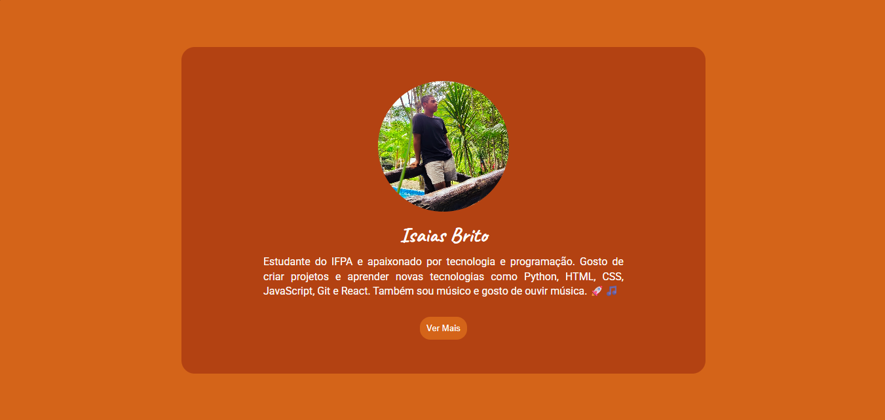

# 💳 Cartão de Perfil

Um cartão de perfil desenvolvido com HTML e CSS como parte dos meus estudos em desenvolvimento web.

## 📸 Preview

## 🚀 Tecnologias utilizadas

- HTML5
- CSS3
- Flexbox
- Google Fonts

## 🛠️ Tecnologias

- 
- 

- ## 🌐 Acesse o projeto

👉 [Clique aqui para visualizar o projeto](https://isaiasbrito189.github.io/cartao-de-perfil/)

## 👨‍💻 Desenvolvido por

Isaias Brito

Estudante de Informática no IFPA e apaixonado por tecnologia e programação.
